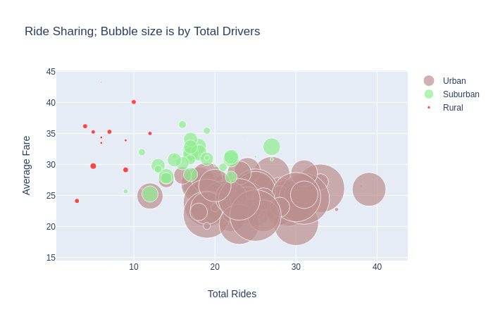
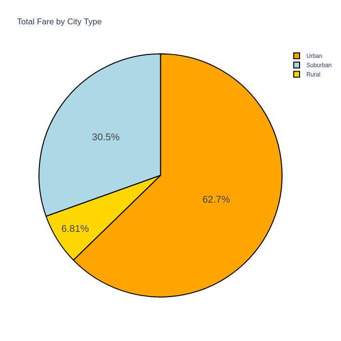
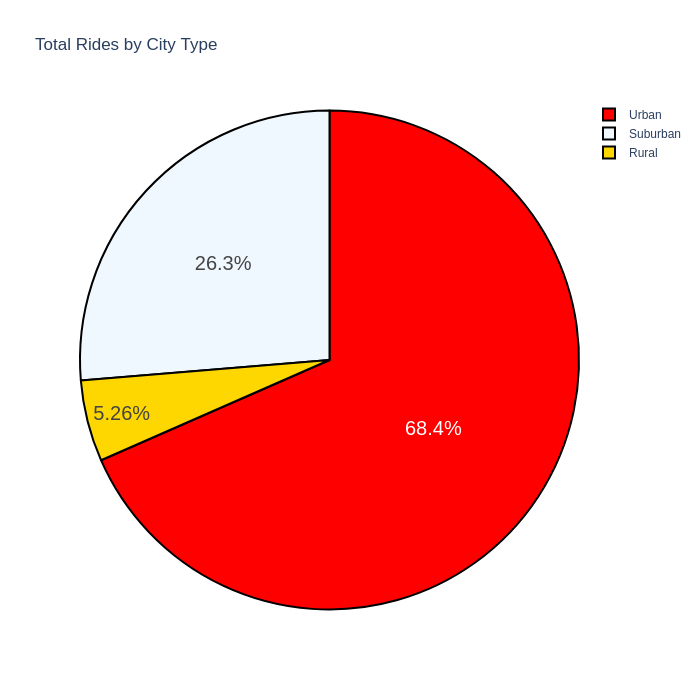

# I was talked with  build a Bubble Plot that showcases the relationship between four key variables:
Average Fare ($) Per City

Total Number of Rides Per City

Total Number of Drivers Per City

City Type (Urban, Suburban, Rural)

# In addition, I was able to three pie charts:

% of Total Fares by City Type

% of Total Rides by City Type

# my analazyas of the dataing. 
I confirmed my hypothesis in more Urban cities have more rides , drivers with total fair being higher than the other two citie types. What Surprised me was Rural average fair was higher than the other two city types. 

